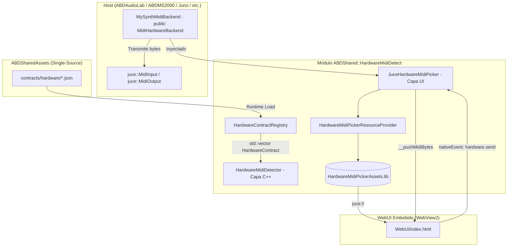

# HardwareMidiDetect — Especificación Técnica y Arquitectura de Módulo Reutilizable

**Versión:** 1.0.0  
**Fecha:** 3 de Septiembre de 2026  
**Autor:** Antigravity / ABDSynths Engineering Team  
**Módulo:** `ABDSharedCode/HardwareMidiDetect`  
**Target CMake:** `ABDShared::HardwareMidiDetect`  
**Proyectos Consumidores:**
- Sintetizadores VST3/AU/Standalone: `ABDMS2000`, `ABDCZ101`, `ABDJUNiO601`, `ABDEep`, `ABDPro008`, `ABDBassStation`, etc.
- Herramientas Científicas y Calibración: `ABDAudioLab`.

---

## 1. Visión y Objetivos del Módulo

`HardwareMidiDetect` es un **módulo compartido universal de detección e identificación de sintetizadores hardware por MIDI y USB**, diseñado bajo la filosofía **DRY**, **Zero-Copy** y **100% Contract-Driven**:

1. **Objetivo Principal**: Proporcionar una detección automática y fiable de hardware musical conectado por USB/MIDI a toda la suite de sintetizadores y herramientas de ABDSynths, eliminando la duplicación de código en cada plugin.
2. **Filosofía 100% Contract-Driven**: Ninguna consulta SysEx (Universal Identity Inquiry, Korg SysEx, Roland SysEx, etc.) ni mapeo de fabricante/modelo está hardcodeado en el código fuente C++ o JS. Todo se deriva dinámicamente de los contratos JSON centrales en `ABDSharedAssets/contracts/hardware/`.
3. **Arquitectura en Dos Capas (Patrón ABDScope)**:
   - **Capa 1 (C++ Puro / Headless)**: `abd::hwid::HardwareMidiDetector` para escaneo programático en segundo plano, pruebas automatizadas y entornos sin interfaz gráfica.
   - **Capa 2 (WebView2 + WebUI)**: `abd::hwid::JuceHardwareMidiPicker` para ofrecer una interfaz moderna de selección asistida, donde el host únicamente "prepara el puente" inyectando el transporte de audio/MIDI (`MidiHardwareBackend`).
4. **Zero-Copy & Single-Source**: Los contratos no se copian a los repositorios de cada plugin; se leen en tiempo de ejecución desde `ABDSharedAssets`.

---

## 2. Principios de Ingeniería y Estándares de Calidad

Siguiendo el estándar de arquitectura establecido en `ABDScope`:

### A. Responsabilidad Única (SRP Estricto)
- `HardwareContract.h`: Define exclusivamente las estructuras de datos de contrato e identidad MIDI.
- `HardwareContractRegistry`: Responsable únicamente de la carga, deserialización JSON y búsqueda de contratos.
- `HardwareMidiDetector`: Motor de escaneo C++ puro, timeouts de respuesta MIDI y parseo de tramas SysEx.
- `MidiHardwareBackend.h`: Contrato abstracto puro que desacopla el transporte MIDI de la lógica de negocio.
- `JuceHardwareMidiPicker.h`: Componente JUCE que aloja WebView2 y enruta eventos entre el backend y el frontend.
- `HardwareMidiPickerResourceProvider`: Servidor MIME seguro de recursos embebidos (`juce://`).
- `WebUI/index.html`: Interfaz de usuario interactiva y presentación visual de dispositivos detectados.

### B. Límites de Complejidad
- Headers de interfaz limpios, sin dependencias innecesarias.
- Separación estricta entre la capa de presentación (WebUI) y el driver de transporte (C++).

---

## 3. Arquitectura del Sistema y Componentes



---

## 4. Contrato de Datos: Especificación del Contrato JSON

Los contratos residen en `ABDSharedAssets/contracts/hardware/*.json` y contienen el bloque declarativo `midiIdentification`:

```json
{
  "id": "korg_ms2000",
  "displayName": "Korg MS2000 / MS2000R",
  "category": "SYNTHESIZER",
  "brand": "Korg",
  "deviceType": "AUTOMATED_MIDI_CC",
  "midiIdentification": {
    "manufacturerIdHex": "42",
    "modelIdHex": "58",
    "sysexHeaderHex": "42 30 58"
  },
  "autoDetectSysEx": "F0 7E 7F 06 01 F7"
}
```

### Campos Clave:
- `manufacturerIdHex`: ID de fabricante MIDI (1 byte estándar o 3 bytes extendidos `00 XX YY`). Ej: `42` (Korg), `41` (Roland), `00 20 32` (Behringer).
- `modelIdHex`: ID de modelo reportado en el payload del Identity Reply (`06 02`).
- `sysexHeaderHex`: Cabecera SysEx propietaria para filtrado secundario.
- `autoDetectSysEx`: Mensaje SysEx de sondeo específico si el modelo no responde al Identity Inquiry Universal broadcast.

---

## 5. Capa 1: C++ Puro (`HardwareMidiDetector`)

Diseñada para escaneos sin interfaz gráfica, diagnósticos de consola y tests automatizados.

### Protocolo de Detección:
1. **Generación de Consultas**: `buildDetectionQueries()` recopila:
   - Universal Non-Real Time Identity Request broadcast: `F0 7E 7F 06 01 F7`.
   - Consultas `autoDetectSysEx` declaradas en los contratos (deduplicadas).
2. **Apertura de Puertos**: Abre secuencialmente cada puerto de entrada/salida MIDI disponible.
3. **Emisión y Escucha con Timeout**: Transmite las consultas y espera `timeoutMs` (por defecto 350 ms).
4. **Decodificación de Respuestas**:
   - `parseIdentityReply()`: Comprueba el formato `F0 7E <devId> 06 02 <manufId...> <modelId...> F7`.
   - Si coincide con un contrato, marca `isSysExVerified = true` y extrae versión de firmware si está disponible.
5. **Heurística de Respaldo**:
   - `matchFromPortNames()`: Si el sintetizador no responde a SysEx (ej. interfaces USB genéricas sin passthrough SysEx), compara heurísticamente el nombre del puerto con las palabras clave declaradas en el contrato.

---

## 6. Capa 2: WebView2 + WebUI (`JuceHardwareMidiPicker`)

Siguiendo el patrón de `ABDScope`, el host no se encarga del renderizado de la UI de selección, sino que delega en el WebUI compartido.

### Puente de Transporte (`MidiHardwareBackend`)
El host implementa la interfaz pura [`MidiHardwareBackend`](file:///D:/desarrollos/ABDSynths/ABDSharedCode/HardwareMidiDetect/MidiHardwareBackend.h):

```cpp
class MySynthMidiBackend : public abd::hwid::MidiHardwareBackend
{
public:
    std::string getOutputPortName() const override { ... }
    void sendBytes(const std::vector<uint8_t>& bytes) override { ... }
    void setReceiveCallback(std::function<void(const std::vector<uint8_t>&)> cb) override { ... }
    void startListening() override { ... }
    void stopListening() override { ... }
    void refreshPorts() override { ... }
};
```

### Contrato del Canal de Comunicación (Canal `nativeEvent`)

| Evento / Mensaje | Dirección | Formato / Parámetros | Propósito |
|---|---|---|---|
| `hardware.send` | WebUI $\to$ Host | `{ payload: "<base64>" }` | Solicita transmitir bytes SysEx por el puerto MIDI de salida. |
| `hardware.listen` | WebUI $\to$ Host | `{}` | Ordena al host abrir el puerto de entrada e iniciar la escucha. |
| `hardware.stop` | WebUI $\to$ Host | `{}` | Detiene la escucha en el puerto de entrada. |
| `hardware.result` | WebUI $\to$ Host | `{ cancelled: bool, hardwareId: string, displayName: string, manufacturer: string, model: string }` | Notifica al host la selección final o cancelación del usuario. |
| `__pushMidiBytes` | Host $\to$ WebUI | `__pushMidiBytes("<base64>")` | Inyecta tramas MIDI/SysEx recibidas hacia el motor analítico de JS. |

---

## 7. Integración en CMake

En el `CMakeLists.txt` del proyecto consumidor:

```cmake
# 1. Enlazar la librería compartida
target_link_libraries(TuProyecto
    PRIVATE
        ABDShared::HardwareMidiDetect
)
```

El target `ABDShared::HardwareMidiDetect` es una librería `INTERFACE` que:
1. Exporta los include directories necesarios (`HardwareMidiDetect/`).
2. Compila los ficheros fuente compartidos en la unidad del consumidor.
3. Enlaza `juce_audio_devices`, `juce_gui_extra`, `juce_core` y `nlohmann_json`.
4. Si JUCE está en scope, compila automáticamente `HardwareMidiPickerAssets` (`juce_add_binary_data`) para que no se requieran ficheros sueltos en disco en tiempo de ejecución.

---

## 8. Vectores de Prueba y Verificación (Test Vectors)

### Vector 1: Korg MS2000 (Universal Identity Reply)
- **Consulta Enviada**: `F0 7E 7F 06 01 F7`
- **Trama de Respuesta Simulado**:
  `F0 7E 00 06 02 42 58 00 00 00 01 00 F7`
- **Resultado Esperado**:
  - `hardwareId`: `"korg_ms2000"`
  - `displayName`: `"Korg MS2000 / MS2000R"`
  - `isSysExVerified`: `true`

### Vector 2: Roland AIRA Modular (Demora / Bitrazer / Torcido)
- **Consulta Enviada**: `F0 7E 7F 06 01 F7`
- **Trama de Respuesta Simulado**:
  `F0 7E 10 06 02 41 40 01 00 00 01 00 F7`
- **Resultado Esperado**:
  - `hardwareId`: `"roland_aira_demora"` o módulo AIRA correspondiente.
  - `isSysExVerified`: `true`
