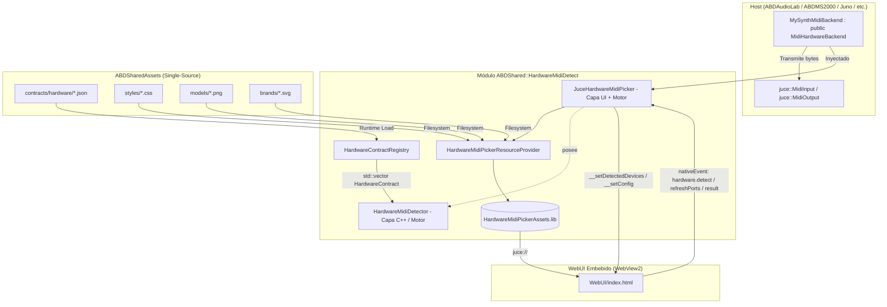

# HardwareMidiDetect — Especificación Técnica y Arquitectura de Módulo Reutilizable

**Versión:** 2.0.0  
**Fecha:** 4 de Septiembre de 2026  
**Autor:** Antigravity / ABDSynths Engineering Team  
**Módulo:** `ABDSharedCode/HardwareMidiDetect`  
**Target CMake:** `ABDShared::HardwareMidiDetect`  
**Proyectos Consumidores:**
- Sintetizadores VST3/AU/Standalone: `ABDMS2000`, `ABDCZ101`, `ABDJUNiO601`, `ABDEep`, `ABDPro008`, `ABDBassStation`, etc.
- Herramientas Científicas y Calibración: `ABDAudioLab`.

---

## 1. Visión y Objetivos del Módulo

`HardwareMidiDetect` es un **módulo compartido universal de detección e identificación de sintetizadores hardware por MIDI y USB**, diseñado bajo la filosofía **DRY**, **Zero-Copy** y **100% Contract-Driven**:

1. **Objetivo Principal**: Proporcionar una detección automática y fiable de hardware musical conectado por USB/MIDI a toda la suite de sintetizadores y herramientas de ABDSynths, eliminando la duplicación de código en cada plugin.
2. **Filosofía 100% Contract-Driven**: Ninguna consulta SysEx (Universal Identity Inquiry, Korg SysEx, Roland SysEx, etc.) ni mapeo de fabricante/modelo está hardcodeado en el código fuente C++ o JS. Todo se deriva dinámicamente de los contratos JSON centrales en `ABDSharedAssets/contracts/hardware/`.
3. **Arquitectura en Dos Capas (Patrón ABDScope)**:
   - **Capa 1 (C++ Puro / Headless)**: `abd::hwid::HardwareMidiDetector` para escaneo programático en segundo plano, pruebas automatizadas y entornos sin interfaz gráfica.
   - **Capa 2 (WebView2 + WebUI)**: `abd::hwid::JuceHardwareMidiPicker` para ofrecer una interfaz moderna de selección asistida, donde el host únicamente "prepara el puente" inyectando el transporte de audio/MIDI (`MidiHardwareBackend`). **El picker usa el detector C++ como motor**; el WebUI es una vista pura.
4. **Zero-Copy & Single-Source**: Los contratos no se copian a los repositorios de cada plugin; se leen en tiempo de ejecución desde `ABDSharedAssets`.
5. **Theme System**: Usa el sistema universal de estilos de `ABDSharedAssets/styles/` (tokens + 5 temas + 7 componentes). WebUI importa `styles/index.css`; host llama `picker->setTheme("audiolab")` → `document.body.dataset.theme`.
6. **Asset Serving**: `index.html` + JS embebidos via `juce_add_binary_data`; `styles/`, `models/`, `brands/` servidos **filesystem** desde `ABDSharedAssets/`.

---

## 2. Principios de Ingeniería y Estándares de Calidad

Siguiendo el estándar de arquitectura establecido en `ABDScope`:

### A. Responsabilidad Única (SRP Estricto)
- `HardwareContract.h`: Define exclusivamente las estructuras de datos de contrato e identidad MIDI.
- `HardwareContractRegistry`: Responsable únicamente de la carga, deserialización JSON y búsqueda de contratos.
- `HardwareMidiDetector`: Motor de escaneo C++ puro, timeouts de respuesta MIDI y parseo de tramas SysEx.
- `MidiHardwareBackend.h`: Contrato abstracto puro que desacopla el transporte MIDI de la lógica de negocio.
- `JuceHardwareMidiPicker.h/.cpp`: Componente JUCE que aloja WebView2, posee `HardwareMidiDetector` como motor, y enruta eventos entre el backend y el frontend.
- `HardwareMidiPickerResourceProvider`: Servidor MIME seguro de recursos embebidos (`juce://`) + filesystem (`ABDSharedAssets/`).
- `WebUI/index.html`: Vista pura de presentación — renderiza lista de dispositivos con imágenes/badges, radio/checkbox según `maxResults`.

### B. Límites de Complejidad
- Headers de interfaz limpios, sin dependencias innecesarias.
- Separación estricta entre la capa de presentación (WebUI) y el driver de transporte (C++).
- Configuración de detección vía `DetectionConfig` struct (whitelist, maxResults, auto-select, heurística).

---

## 3. Arquitectura del Sistema y Componentes



---

## 4. Contrato de Datos: Especificación del Contrato JSON

Los contratos residen en `ABDSharedAssets/contracts/hardware/*.json` y contienen el bloque declarativo `midiIdentification`:

```json
{
  "id": "korg_ms2000",
  "displayName": "Korg MS2000 / MS2000R",
  "category": "SYNTHESIZER",
  "brand": "Korg",
  "deviceType": "AUTOMATED_MIDI_CC",
  "midiIdentification": {
    "manufacturerIdHex": "42",
    "modelIdHex": "58",
    "sysexHeaderHex": "42 30 58"
  },
  "autoDetectSysEx": "F0 7E 7F 06 01 F7",
  "modelImage": "models/korg-ms2000.png",
  "brandLogo": "brands/korg-logo.svg"
}
```

### Campos Clave:
- `manufacturerIdHex`: ID de fabricante MIDI (1 byte estándar o 3 bytes extendidos `00 XX YY`). Ej: `42` (Korg), `41` (Roland), `00 20 32` (Behringer).
- `modelIdHex`: ID de modelo reportado en el payload del Identity Reply (`06 02`).
- `sysexHeaderHex`: Cabecera SysEx propietaria para filtrado secundario.
- `autoDetectSysEx`: Mensaje SysEx de sondeo específico si el modelo no responde al Identity Inquiry Universal broadcast.
- `modelImage`: Ruta relativa a imagen del modelo en `ABDSharedAssets/models/`.
- `brandLogo`: Ruta relativa a logo de marca en `ABDSharedAssets/brands/`.

---

## 5. Capa 1: C++ Puro (`HardwareMidiDetector`)

Diseñada para escaneos sin interfaz gráfica, diagnósticos de consola y tests automatizados.

### DetectionConfig
```cpp
struct DetectionConfig {
    std::vector<std::string> allowedHardwareIds;  // whitelist (vacío = todos)
    int maxResults = 1;                            // 1 = single, >1 = multi
    bool autoSelectIfSingle = true;                // auto-callback si 1 match
    bool includeHeuristic = true;                  // incluir matches por nombre puerto
    bool requireSysExVerified = false;             // solo SysEx verificado
};
```

### DiscoveredDevice (enriquecido)
```cpp
struct DiscoveredDevice {
    std::string hardwareId, displayName, manufacturer, model, firmwareVersion;
    juce::MidiDeviceInfo inDevice, outDevice;
    int portIndex { -1 };           // índice en array puertos salida
    uint8_t deviceId { 0 };         // deviceId del Identity Reply (byte 1)
    uint8_t midiChannel { 0 };      // canal MIDI 1-16 (0 = unknown)
    bool isSysExVerified { false }; // true = verificado por SysEx
    std::string modelImage;         // "models/korg-ms2000.png"
    std::string brandLogo;          // "brands/korg-logo.svg"
};
```

### Protocolo de Detección:
1. **Generación de Consultas**: `buildDetectionQueries()` recopila Universal broadcast + cada `autoDetectSysEx` único (deduplicados).
2. **Apertura de Puertos**: Abre secuencialmente cada puerto de salida; empareja entrada por nombre/identifier.
3. **Emisión y Escucha con Timeout**: Transmite queries y espera `timeoutMs` (defecto 350 ms).
4. **Decodificación de Respuestas**: `parseIdentityReply()` verifica formato `F0 7E <devId> 06 02 <manufId...> <modelId...> F7` contra contratos; marca `isSysExVerified` y extrae firmware.
5. **Heurística de Respaldo** (opcional): `matchFromPortNames()` compara nombre de puerto con `portNameMatches` del contrato.
6. **Filtrado**: Whitelist (`allowedHardwareIds`), SysEx verification (`requireSysExVerified`), límite (`maxResults`).
7. **Enriquecimiento**: Añade `modelImage`/`brandLogo` del contrato matchado.

---

## 6. Capa 2: WebView2 + WebUI (`JuceHardwareMidiPicker`)

### Puente de Transporte (`MidiHardwareBackend`)
El host implementa la interfaz pura:

```cpp
class MySynthMidiBackend : public abd::hwid::MidiHardwareBackend
{
public:
    std::string getOutputPortName() const override { ... }
    void sendBytes(const std::vector<uint8_t>& bytes) override { ... }
    void setReceiveCallback(std::function<void(const std::vector<uint8_t>&)> cb) override { ... }
    void startListening() override { ... }
    void stopListening() override { ... }
    void refreshPorts() override { ... }
};
```

### Contrato del Canal `nativeEvent`

| Evento / Mensaje | Dirección | Formato / Parámetros | Propósito |
|---|---|---|---|
| `hardware.detect` | WebUI → Host | `{}` | Usuario clicó "Detect" → C++ ejecuta `detector.scanAllPorts(config)` |
| `hardware.refreshPorts` | WebUI → Host | `{}` | Usuario clicó "Rescan" → `backend.refreshPorts()` + re-scan |
| `hardware.result` | WebUI → Host | Ver abajo | Usuario seleccionó dispositivo(s) o canceló |
| `__setDetectedDevices` | Host → WebUI | `devices[] + config` | C++ empuja resultados + config (maxResults) |
| `__setConfig` | Host → WebUI | `{maxResults}` | C++ informa modo single/multi para radio/checkbox |

**`hardware.result` payload (single / multi):**

```json
// Single (maxResults=1):
{
  "action": "hardware.result",
  "cancelled": false,
  "hardwareId": "korg_ms2000",
  "displayName": "Korg MS2000 / MS2000R",
  "manufacturer": "42",
  "model": "58",
  "firmwareVersion": "01020304"
}

// Multi (maxResults>1):
{
  "action": "hardware.result",
  "cancelled": false,
  "hardwareIds": ["korg_ms2000", "roland_juno106"],
  "displayNames": ["Korg MS2000 / MS2000R", "Roland JUNO-106"],
  "manufacturer": "42",
  "model": "58",
  "firmwareVersion": "01020304"
}
```

---

## 7. Theme System (estilo ABDScope)

El WebUI usa el sistema universal de estilos de `ABDSharedAssets/styles/`:

```html
<link rel="stylesheet" href="styles/index.css">
<body data-theme="audiolab">  <!-- Default, host lo cambia via setTheme() -->
```

```cpp
// Temas disponibles: "ms2000", "cz101", "deepmind", "juno", "audiolab"
picker->setTheme("audiolab"); // cambia colores, bordes, scrollbars automáticamente
```

Tokens CSS usados: `--color-bg-base`, `--color-panel-bg`, `--color-panel-border`, `--color-accent`, `--color-success`, `--color-warning`, `--color-danger`, `--font-sans`, `--radius-md`, `--space-*`, `--transition-fast`.
Clases de componentes: `.btn`, `.btn-primary`, `.btn-ghost`, `.led-indicator`, `.panel` (de `components/panels.css`).
Scrollbars globales coherentes definidos en `tokens.css` + overrides por tema.

---

## 8. Asset Serving (Filesystem vs Embed)

| Tipo | Origen | Servido por |
|------|--------|-------------|
| `index.html`, `*.js` (root) | Embedded binary data | `HardwareMidiPickerAssets` (`juce_add_binary_data`) |
| `styles/**/*` | `ABDSharedAssets/styles/` | `HardwareMidiPickerResourceProvider` (filesystem) |
| `models/**/*` | `ABDSharedAssets/models/` | `HardwareMidiPickerResourceProvider` (filesystem) |
| `brands/**/*` | `ABDSharedAssets/brands/` | `HardwareMidiPickerResourceProvider` (filesystem) |

---

## 9. Integración en CMake

En el `CMakeLists.txt` del proyecto consumidor:

```cmake
target_link_libraries(TuProyecto
    PRIVATE
        ABDShared::HardwareMidiDetect
)
```

El target `ABDShared::HardwareMidiDetect` es una librería `INTERFACE` que:
1. Exporta include directories `HardwareMidiDetect/`.
2. Compila fuentes compartidas en la unidad del consumidor.
3. Enlaza `juce_audio_devices`, `juce_gui_extra`, `juce_core`, `nlohmann_json`.
4. Si JUCE está en scope, compila `HardwareMidiPickerAssets` (`juce_add_binary_data`) para `index.html` + JS root.

---

## 10. Vectores de Prueba y Verificación (Test Vectors)

### Vector 1: Korg MS2000 (Universal Identity Reply)
- **Consulta Enviada**: `F0 7E 7F 06 01 F7`
- **Trama de Respuesta Simulado**: `F0 7E 00 06 02 42 58 00 00 00 01 00 F7`
- **Resultado Esperado**:
  - `hardwareId`: `"korg_ms2000"`
  - `displayName`: `"Korg MS2000 / MS2000R"`
  - `isSysExVerified`: `true`
  - `deviceId`: `0x00`
  - `modelImage`: `"models/korg-ms2000.png"`
  - `brandLogo`: `"brands/korg-logo.svg"`

### Vector 2: Roland AIRA Modular (Demora / Bitrazer / Torcido)
- **Consulta Enviada**: `F0 7E 7F 06 01 F7`
- **Trama de Respuesta Simulado**: `F0 7E 10 06 02 41 40 01 00 00 01 00 F7`
- **Resultado Esperado**:
  - `hardwareId`: `"roland_aira_demora"`
  - `displayName`: `"Roland AIRA Demora"`
  - `isSysExVerified`: `true`
  - `deviceId`: `0x10`