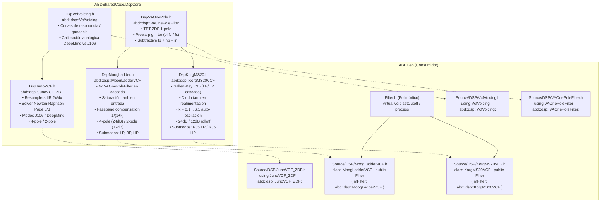

# Guía de Diseño e Integración — Filtros Analógicos Modelados (`abd::dsp`)

> **Módulo:** `DspCore`  
> **Espacio de nombres:** `abd::dsp`  
> **Target CMake:** `ABDShared::DspCore`  
> **Cabeceras Canónicas:**  
> • `ABDSharedCode/DspCore/DspJunoVCF.h`  
> • `ABDSharedCode/DspCore/DspVcfVoicing.h`  
> • `ABDSharedCode/DspCore/DspVAOnePole.h`  
> • `ABDSharedCode/DspCore/DspMoogLadder.h`  
> • `ABDSharedCode/DspCore/DspKorgMS20.h`  
> **Estándar C++:** C++17 / C++20  
> **Dependencias:** Ninguna (100% C++ puro estándar, `<cmath>`, `<algorithm>`, libre de JUCE)  
> **Garantía de Tiempo Real:** Zero-alloc en lazo de audio, noexcept/RT-safe, precisión `double` en estados integradores, modelado no lineal de saturación analógica.

---

## 1. Contexto y Objetivos

Dentro del ecosistema ABDSynths (especialmente en **ABDEep** y extensiones multi-modelo para **ABDJUNiO601**, **ABDMS2000** y **ABDCZ101**), los sintetizadores incorporan modelos avanzados de filtrado analógico virtual:
1. **Filtro OTA IR3109 / 80017A en Cascada ZDF (`JunoVCF_ZDF` + `VcfVoicing`):** Emulación de la clásica topología de 4 polos OTA con sobremuestreo polifásico IIR (2x/4x), aproximación Padé 3/3 de saturación $\tanh$, solucionador no lineal Newton-Raphson de 1 paso y perfiles de sonoridad inyectados (Juno-106 vs DeepMind).
2. **Filtro de Escalera de Transistores Moog (`MoogLadderVCF`):** Emulación de la clásica topología de escalera de 4 polos con saturación no lineal diferencial y compensación de pérdida de graves por resonancia.
3. **Filtro Sallen-Key Korg MS-20 (`KorgMS20VCF`):** Emulación de la topología Korg35 basada en pares Sallen-Key con saturación en el lazo de realimentación modelada mediante recorte por diodos.
4. **Bloque Primario TPT ZDF de 1 Polo (`VAOnePoleFilter`):** El bloque integrador elemental utilizado para construir las topologías Moog y MS-20.

Originalmente estos componentes residían localmente en `ABDEep/Source/DSP/`. El objetivo de esta promoción es:
* Elevar estos bloques a **`ABDSharedCode/DspCore`** como parte del sustrato analógico compartido.
* Desvincularlos de tipos JUCE o dependencias de plataforma (100% C++ estándar).
* Mantener precisión numérica con acumuladores `double` y protección anti-denormales.
* Sustituir los originales en **ABDEep** por *shims* delegados de coste cero que preservan la jerarquía polimórfica de `ABD::Filter`.

---

## 2. Mapa Arquitectónico



---

## 3. Fundamentos Matemáticos y Algorítmicos

### 3.1. Filtro OTA IR3109 / 80017A ZDF (`JunoVCF_ZDF` + `VcfVoicing`)

* **Aproximación Padé [3/3] de Saturación OTA:**
  Para modelar la transconductancia no lineal del chip IR3109 / 80017A sin el alto coste de funciones trascendentes por etapa:
  $$\text{OTASat}(x) \approx x \frac{27 + x^2}{27 + 9 x^2} \quad (|x| \le 3.0)$$
  $$\text{OTASatDeriv}(x) \approx \frac{27 (27 - 3 x^2)}{(27 + 9 x^2)^2}$$
* **Solucionador no lineal Newton-Raphson de 1 paso:**
  Cada una de las 4 etapas integra $s$ resolviendo el lazo implícito:
  $$y = s + g_1 (x - s), \quad f = y - s - g \cdot \frac{\text{OTASat}(sd)}{\text{otaScale}}$$
  $$y \leftarrow y - \frac{f}{1 + g \cdot \text{OTASatDeriv}(sd)}, \quad s \leftarrow 2y - s$$
* **Sobremuestreo Polifásico IIR (Laurent de Soras):**
  Filtros alógenos de fase mínima con 12 coeficientes optimizados para subida y bajada 2x/4x sin ringing en fase de audio.
* **Perfiles Inyectados (`VcfVoicing`):**
  * **Juno-106:** Curva polinómica de 4º orden $ResK\_J106(res)$, ganancia unitaria, saturación estándar.
  * **DeepMind 12:** Curva $ResK\_J106(res)$ combinada con compensación de ganancia $1 / (1 + 2 res^2)$ y saturación de etapa en $0.70$.

---

### 3.2. Integrador Elemental TPT ZDF (`VAOnePoleFilter`)

Basado en la transformada conservadora de topología (*Topology-Preserving Transform*):
* **Fórmula de pre-warping bilineal:**
  $$f_c = \text{clamp}(cutoffHz, 10.0, f_s \times 0.49)$$
  $$g = \tan\left(\frac{\pi f_c}{f_s}\right)$$
  $$\alpha = \frac{g}{1 + g} \quad \in [0, 1)$$

* **Ecuaciones de proceso por muestra:**
  $$v_n = \alpha (x_n + fb) - z_1 \alpha$$
  $$lp = v_n + z_1$$
  $$z_{1,\text{next}} = v_n + lp = 2 v_n + z_1$$
  $$hp = x_n - lp$$

* **Protección denormal:**  
  Si $|z_1| < 10^{-15}$, se restablece $z_1 = 0$ para evitar degradación de rendimiento por números subnormales.

---

### 3.2. Filtro de Escalera Moog (`MoogLadderVCF`)

* **Estructura:** Cuatro etapas `VAOnePoleFilter` conectadas en serie con realimentación global desde la última etapa.
* **Ganancia de realimentación y resonancia:**
  $$k = 3.88 \times \text{resonance} \quad (k \in [0, 3.88])$$
* **Compensación de paso de banda (Bass Compensation):**
  A diferencia del circuito lineal ideal donde la resonancia debilita drásticamente las frecuencias bajas, se aplica ganancia de normalización de entrada:
  $$\text{inputGain} = \frac{1}{1 + k}$$
* **Saturación no lineal transistorizada:**
  Para modelar el comportamiento suave del par diferencial de transistores de entrada y estabilizar el lazo:
  $$x = \tanh(\text{sample})$$
  $$in = \text{inputGain} \cdot (x + k \cdot \text{inputGain} \cdot lp_4)$$
* **Salidas y Modos:**
  * **Pole Mode 0 (4 polos, 24 dB/oct):** Salida de la etapa 4 ($lp_4$).
  * **Pole Mode 1 (2 polos, 12 dB/oct):** Salida de la etapa 2 ($lp_2$).
  * **SubMode 0 (Lowpass):** Salida de polos seleccionada.
  * **SubMode 1 (Bandpass):** $lp_2 - lp_4$ (énfasis en banda media).
  * **SubMode 2 (Highpass):** $x - lp_4$ (sustractivo).

---

### 3.3. Filtro Sallen-Key Korg MS-20 K35 (`KorgMS20VCF`)

* **Estructura:** Parejas en cascada de etapas pasa-bajos y pasa-altos.
* **Ganancia de resonancia y auto-oscilación:**
  $$k = 0.1 + 6.0 \times \text{resonance} \quad (k \in [0.1, 6.1])$$
  En valores altos de $k$, el filtro entra en auto-oscilación agresiva característica del circuito K35.
* **Saturación en el lazo por par de diodos:**
  La realimentación no se aplica directamente a la entrada sino que se conforma no linealmente mediante un modelado de diodos con $\tanh$:
  $$\text{feedback} = \tanh(k \cdot \text{tap})$$
* **Modos de Operación:**
  * **SubMode 0 (K35 Lowpass):**  
    Entrada $x = \text{sample} + \tanh(k \cdot lp_2)$. Se procesa $lp_1$ y $lp_2$.  
    Pole mode 1 selecciona $lp_1$ (12 dB/oct); pole mode 0 selecciona $lp_2$ (24 dB/oct).
  * **SubMode 1 (K35 Highpass):**  
    Entrada $x = \text{sample} + \tanh(k \cdot hp_2)$. Se procesa $hp_1$ y $hp_2$ con frecuencia sintonizada a $2 \times f_c$ (convención MS-20).  
    Pole mode 1 selecciona $hp_1$ (12 dB/oct); pole mode 0 selecciona $hp_2$ (24 dB/oct).

---

## 4. Integración y Uso

### 4.1. Enlace CMake

El módulo `ABDShared::DspCore` es `INTERFACE` (header-only). Para consumirlo:

```cmake
target_link_libraries(TuProyecto PRIVATE ABDShared::DspCore)
```

Las cabeceras se incluyen desde `DspCore/`:
```cpp
#include "DspCore/DspVAOnePole.h"
#include "DspCore/DspMoogLadder.h"
#include "DspCore/DspKorgMS20.h"
```
O directamente mediante `#include "DspCore/DspCore.h"`.

### 4.2. Ejemplo de Uso Directo C++ (Agnóstico / Sin JUCE)

```cpp
#include "DspCore/DspMoogLadder.h"

abd::dsp::MoogLadderVCF filter;
filter.prepare(44100.0);
filter.setCutoff(1200.0f);     // En Hz
filter.setResonance(0.75f);    // 0..1
filter.setPoleMode(0);         // 4-pole (24 dB)
filter.setSubMode(0);          // Lowpass

for (int i = 0; i < numSamples; ++i)
{
    outputBuffer[i] = filter.process(inputBuffer[i]);
}
```

---

## 5. Batería de Pruebas y Validación

La promoción cuenta con doble barrera de pruebas:

1. **Suite Standalone de `DspCore` (`ABDShared_DspCore_Tests`):**
   * Función `testAnalogModeledFilters()` añadida a `DspCore/DspCoreTests.cpp`.
   * Verifica la convergencia DC de `VAOnePoleFilter`, la identidad sustractiva $lp + hp = in$, y el restablecimiento de estado.
   * Verifica que `MoogLadderVCF` converge a $\tanh(1.0) \approx 0.762$, se mantenga acotado $\le 3.0$ a máxima resonancia con saturación suave, y atenúe frecuencias agudas (5 kHz con corte en 100 Hz $< 0.1$).
   * Verifica que `KorgMS20VCF` mantenga auto-oscilación acotada $\le 10.0$ gracias al clipper de diodos, rechace altas frecuencias y conmute entre modos LP y HP.

2. **Suite de Integración de `ABDEep`:**
   * `SynthEngineVCFUnitTests`: Comprueba las instancias polimórficas de `MoogLadderVCF` y `KorgMS20VCF` bajo `DEEP_TARGET_MODEL >= 2`.
   * `SynthEngineRapidSweepTests`: Realiza barridos rápidos multidimensionales (corte, resonancia, submodos, polos) verificando ausencia total de NaN/Inf.
