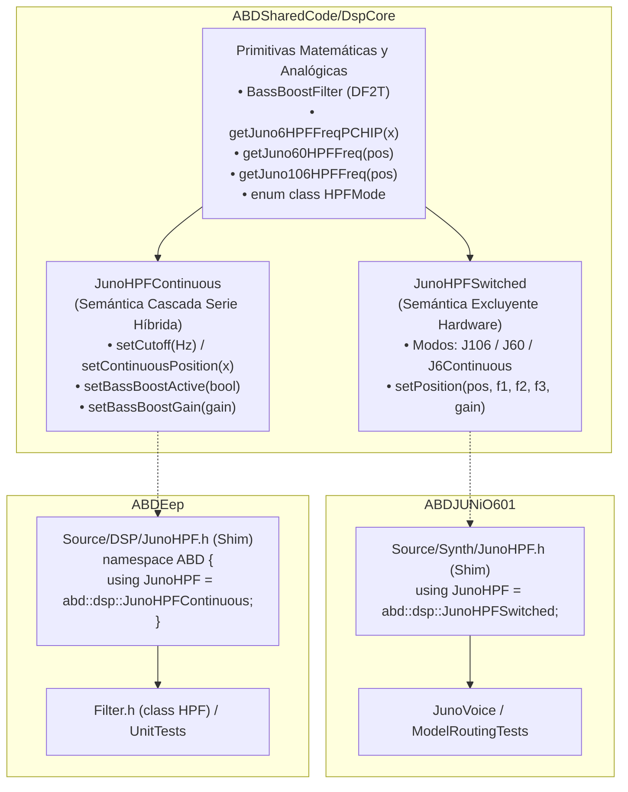

# Guía de Diseño e Integración — JunoHPF (`abd::dsp`)

> **Módulo:** `DspCore`  
> **Espacio de nombres:** `abd::dsp`  
> **Target CMake:** `ABDShared::DspCore`  
> **Cabecera Canónica:** `ABDSharedCode/DspCore/DspJunoHPF.h`  
> **Estándar C++:** C++17 / C++20  
> **Dependencias:** Ninguna (100% C++ puro estándar, `<cmath>`, `<algorithm>`, libre de JUCE)  
> **Garantía de Tiempo Real:** Zero-alloc, noexcept, `double` para acumuladores bilineales, determinismo bit-exacto por muestra.

---

## 1. Contexto y Objetivos

Los sintetizadores **ABDEep** y **ABDJUNiO601** comparten la misma base física y matemática del filtro pasa-altos analógico de la familia Roland Juno:
1. El **filtro biquad de refuerzo de graves (Bass Boost)** derivado del circuito analógico del Juno-106.
2. La **curva de interpolación continua PCHIP** de 11 puntos medidos del potenciómetro del Juno-6.
3. El **núcleo pasa-altos TPT de 1 polo** (*Topology-Preserving Transform*) con pre-warping bilineal $\tan(\pi f_c / f_s)$.

Sin embargo, existía divergencia en su orquestación y semántica de conmutación:
- **`ABDJUNiO601`** modela el selector rotatorio/deslizante mecánico de 4 posiciones con comportamientos **mutuamente excluyentes** (en Juno-106 pos 0 activa el refuerzo de graves mientras que el filtro pasa-altos queda en derivación; pos 1 es Flat; pos 2 y 3 son cortes TPT fijos).
- **`ABDEep`** modela un sintetizador continuo híbrido donde el corte HPF (continuo 0 a 20 kHz o mapeado por PCHIP) y el Bass Boost operan en **cascada serie independiente** ($x \to \text{TPT HPF} \to \text{BassBoost} \to y$).

El objetivo de este diseño es unificar las primitivas analógicas y ambas semánticas en **`ABDSharedCode/DspCore`**, desacoplándolas por completo de JUCE y proveyendo *shims* de compatibilidad 100% transparentes en los repositorios cliente.

---

## 2. Mapa Arquitectónico



---

## 3. Primitivas Físicas y Matemáticas

### 3.1. Filtro de Refuerzo de Graves (`BassBoostFilter`)
Modelado directamente a partir de la simulación de circuito analógico ngspice de la etapa de graves del Juno-106:

* **Componentes de circuito:**
  * $R_1 = 47\text{ k}\Omega$, $C_1 = 0.047\ \mu\text{F}$, $C_A = 0.01\ \mu\text{F}$
  * $R_g = 10\text{ k}\Omega$, $R_f = 100\text{ k}\Omega$, $C_f = 0.022\ \mu\text{F}$
  * $R_{43} = 47\text{ k}\Omega$, $R_{44} = 220\text{ k}\Omega$, $R_{45} = 47\text{ k}\Omega$

* **Constantes de tiempo continuas:**
  $$\tau_{1z} = R_1 C_1, \quad \tau_{1p} = R_1 (C_1 + C_A)$$
  $$\tau_{2z} = \frac{R_g R_f}{R_g + R_f} C_f, \quad \tau_{2p} = R_f C_f$$
  $$G_{2,dc} = 1 + \frac{R_f}{R_g}, \quad \alpha = \frac{R_{45}}{R_{44}}, \quad \text{direct} = \frac{R_{45}}{R_{43}}$$

* **Función de transferencia continua $H(s)$:**
  $$D_0 = 1, \quad D_1 = \tau_{1p} + \tau_{2p}, \quad D_2 = \tau_{1p} \tau_{2p}$$
  $$N_0 = \text{direct} \cdot D_0 + (\alpha G_{2,dc}), \quad N_1 = \text{direct} \cdot D_1 + (\alpha G_{2,dc})(\tau_{1z} + \tau_{2z}), \quad N_2 = \text{direct} \cdot D_2 + (\alpha G_{2,dc})(\tau_{1z} \tau_{2z})$$

* **Transformada Bilineal discretizada:**
  Con sustitución $s \leftarrow 2 f_s \frac{1 - z^{-1}}{1 + z^{-1}}$, se resuelve en topología **Direct Form II Transposed (DF2T)**:
  $$y[n] = b_0 x[n] + z_1[n-1]$$
  $$z_1[n] = b_1 x[n] - a_1 y[n] + z_2[n-1]$$
  $$z_2[n] = b_2 x[n] - a_2 y[n]$$
  Los estados internos $z_1, z_2$ se almacenan como `double` para eliminar deriva numérica y denormales a frecuencias subsónicas.

### 3.2. Curva Monótona Cúbica de Hermite (`getJuno6HPFFreqPCHIP`)
El control continuo de corte del Juno-6 utiliza un potenciómetro analógico medido en 11 puntos:
$$\{38.6, 83.5, 181.3, 394.7, 418.4, 437.1, 455.8, 605.5, 988.6, 1183.2, 1394.2\}\text{ Hz}$$
Para evitar sobre-oscilaciones (*overshoot/ringing*) típicas de splines naturales estándar en curvas no lineales empinadas, se implementa interpolación PCHIP (*Piecewise Cubic Hermite Interpolating Polynomial*) con pendientes dadas por la media armónica:
$$m_k = \frac{2}{\frac{1}{d_{k-1}} + \frac{1}{d_k}} \quad (\text{si } d_{k-1} d_k > 0, \text{ de lo contrario } 0)$$

### 3.3. Frecuencias de Conmutación Fijas
* **Juno-60 (`getJuno60HPFFreq`):**
  * Posición 0: $0\text{ Hz}$ (Flat / Bypass).
  * Posición 1: $122\text{ Hz}$ ($0.022\ \mu\text{F}$ capacitor).
  * Posición 2: $269\text{ Hz}$ ($0.01\ \mu\text{F}$ capacitor).
  * Posición 3: $571\text{ Hz}$ ($0.0047\ \mu\text{F}$ capacitor).
* **Juno-106 (`getJuno106HPFFreq`):**
  * Posición 0: $-1.0\text{ Hz}$ (Centinela indicador de Bass Boost).
  * Posición 1: $0\text{ Hz}$ (Flat / Bypass).
  * Posición 2: $236\text{ Hz}$ ($0.015\ \mu\text{F}$ capacitor).
  * Posición 3: $754\text{ Hz}$ ($0.0047\ \mu\text{F}$ capacitor).

### 3.4. Núcleo Pasa-Altos TPT de 1 Polo
* Pre-warping bilineal sin distorsión de fase ni desfase de retardo:
  $$g = \tan\left(\frac{\pi f_c}{f_s}\right)$$
  *(Utilizando `abd::dsp::MathConstants<float>::pi`)*
* Paso instantáneo de variable de estado TPT:
  $$v = \frac{(x - s) \cdot g}{1 + g}, \quad \text{lp} = s + v, \quad s_{\text{next}} = \text{lp} + v, \quad y = x - \text{lp}$$

---

## 4. Contratos de Clase

### 4.1. `JunoHPFSwitched` (Semántica Hardware Excluyente)
Diseñado para la emulación exacta del panel y ruteo de hardware del Juno-60/Juno-106.

```cpp
namespace abd::dsp {

enum class HPFMode { J106 = 0, J60, J6Continuous };

struct JunoHPFSwitched
{
    BassBoostFilter bassBoost;
    float hpState = 0.f;
    float hpG     = 0.f;

    HPFMode mode        = HPFMode::J106;
    int   currentPos    = 1;
    float currentFreqHz = 0.f;
    float sampleRate    = 44100.f;
    float bassBoostGain = 1.0f;

    void prepare(double sr) noexcept;
    void reinit(double sr) noexcept;
    void reset() noexcept;

    void setMode(HPFMode newMode) noexcept;
    void setPosition(int pos, float freq1Hz = 0.f, float freq2Hz = 0.f, float freq3Hz = 0.f, float bbGain = 1.0f) noexcept;
    void setContinuousPosition(float sliderVal, float bbGain = 1.0f) noexcept;
    void updateCoefs() noexcept;

    float process(float x) noexcept;
    void processBlock(float* buffer, size_t numSamples) noexcept;
};

}
```

* **Comportamiento en `process(x)`:**
  1. Si `mode == HPFMode::J106 && currentFreqHz < 0.0f` $\implies$ Procesa `bassBoost.process(x) * bassBoostGain`.
  2. Si `currentFreqHz <= 0.0f` $\implies$ Señal plana sin alterar (`return x`).
  3. Si `currentFreqHz > 0.0f` $\implies$ Filtro TPT pasa-altos de 1 polo.

---

### 4.2. `JunoHPFContinuous` (Semántica Híbrida Cascada Serie)
Diseñado para el motor de ABDEep, donde el corte de agudos y el refuerzo analógico de graves pueden coexistir y modularse de forma independiente.

```cpp
namespace abd::dsp {

struct JunoHPFContinuous
{
    BassBoostFilter bassBoost;
    float hpState = 0.f;
    float hpG     = 0.f;

    float currentFreqHz   = 0.f;
    float sampleRate      = 44100.f;
    float bassBoostGain   = 1.0f;
    bool  bassBoostActive = false;

    void prepare(double sr) noexcept;
    void reset() noexcept;

    void setCutoff(float cutoffHz) noexcept;
    void setContinuousPosition(float sliderVal) noexcept;
    void setBassBoostGain(float gain) noexcept;
    void setBassBoostActive(bool active) noexcept;
    void updateCoefs() noexcept;

    float process(float x) noexcept;
    void processBlock(float* buffer, size_t numSamples) noexcept;
};

}
```

* **Comportamiento en `process(x)`:**
  1. Si `hpG > 0.0f` $\implies$ Filtra por TPT HPF ($y = x - \text{lp}$).
  2. Si `bassBoostActive == true` $\implies$ Aplica en serie el refuerzo de graves: $y = \text{bassBoost.process}(y) \cdot \text{bassBoostGain}$.
  3. Devuelve $y$.

---

## 5. Invariantes de Compatibilidad de Tests

Durante la auditoría de código se identificaron los siguientes puntos que garantizan retrocompatibilidad absoluta sin romper ningún test unitario preexistente:

1. **Campos públicos directos:**
   - En `ABDEep` (`SynthEngineUnitTests_Drift.cpp:170`), los tests ejecutan directamente:
     ```cpp
     hpfOn.bassBoostActive = true;
     hpfOn.bassBoostGain = 1.5f;
     ```
     `bassBoostActive` y `bassBoostGain` deben ser miembros públicos de `JunoHPFContinuous`.
   - En `ABDJUNiO601` (`ModelRoutingTests.cpp:851`), los tests verifican:
     ```cpp
     expect(hpf.currentFreqHz == 0.0f);
     ```
     `currentFreqHz` debe ser miembro público de `JunoHPFSwitched`.
2. **Firmas de `prepare`:**
   - Sobrecarga implícita o conversión directa `double` / `float` en ambas clases.
3. **Funciones libres auxiliares:**
   - `getJuno60HPFFreq`, `getJuno106HPFFreq` y `getJuno6HPFFreqPCHIP` deben permanecer accesibles como funciones libres `inline` en el namespace `abd::dsp` y re-exportadas en los shims.

---

## 6. Shims de Integración en Repositorios Hermanos

### 6.1. `ABDEep/Source/DSP/JunoHPF.h`
```cpp
#pragma once

#include "DspCore/DspJunoHPF.h"

namespace ABD
{
    using BassBoostFilter = abd::dsp::BassBoostFilter;
    using JunoHPF         = abd::dsp::JunoHPFContinuous;

    using abd::dsp::getJuno6HPFFreqPCHIP;
}
```

### 6.2. `ABDJUNiO601/Source/Synth/JunoHPF.h`
```cpp
#pragma once

#include "DspCore/DspJunoHPF.h"

using HPFMode         = abd::dsp::HPFMode;
using BassBoostFilter = abd::dsp::BassBoostFilter;
using JunoHPF         = abd::dsp::JunoHPFSwitched;

using abd::dsp::getJuno60HPFFreq;
using abd::dsp::getJuno106HPFFreq;
using abd::dsp::getJuno6HPFFreqPCHIP;
```

---

## 7. Plan de Verificación y Calidad

1. **Tests Unitarios en `ABDSharedCode` (`DspCoreTests.cpp`):**
   - Coeficientes de `BassBoostFilter` a 44.1 kHz, 48 kHz y 96 kHz.
   - Monotonía estricta de `getJuno6HPFFreqPCHIP` en todo el recorrido $x \in [0.0, 1.0]$.
   - Mapeo exacto de posiciones 0 a 3 de `getJuno60HPFFreq` y `getJuno106HPFFreq`.
   - Paridad de salida muestra a muestra de `JunoHPFContinuous` frente al antiguo `ABDEep/Source/DSP/JunoHPF.h`.
   - Paridad de salida muestra a muestra de `JunoHPFSwitched` frente al antiguo `ABDJUNiO601/Source/Synth/JunoHPF.h`.
2. **Batería de Tests en `ABDEep`:**
   - Ejecución de `SynthEngineUnitTests_Drift` y `SynthEngineUnitTests_RapidSweep` sin fallos.
3. **Batería de Tests en `ABDJUNiO601`:**
   - Ejecución de `ModelRoutingTests` (sección `JunoHPFModelTests`) sin fallos.
